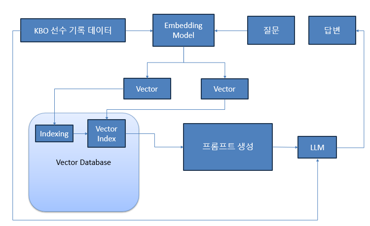

# KBO 기록 알리미 챗봇 ⚾

**KBO 기록 알리미 챗봇**은 한국 프로야구(KBO) 선수들의 기록을 실시간으로 조회할 수 있는 대화형 웹 애플리케이션입니다. 사용자는 특정 선수나 팀의 기록을 쉽게 검색하고, 이를 바탕으로 유익한 정보를 얻을 수 있습니다. 이 프로젝트는 **LangChain**, **FAISS**, **ChatOllama**, **Streamlit** 등의 최신 기술을 사용하여 구축되었습니다.

## 사용한 기술
RAG

1. 데이터 수집 및 전처리
   - KBO 선수 기록이 저장된 CSV파일
   - 데이터 전처리 : 불필요한 정보 제거 및 표준화된 형식으로 변환
2. 임베딩 생성
   - 각 선수 기록을 벡터표현으로 변환하여 벡터스토어에 저장 가능하도록 준비
3. 벡터 생성 및 저장
   - 생성된 벡터를 기반으로 FAISS 벡터 데이터베이스에 저장 
   - 효율적인 검색을 위해 인덱싱 과정 추가
4. 사용자의 질문 처리
   - 사용자가 특정 선수의 기록 또는 특정 팀의 선수 정보를 요청
   - 사용자의 질문과 관련된 벡터를 데이터 베이스에서 검색
   - 검색된 벡터를 맥락정보(Context)로 활용
5. 프롬프트 생성
   - 사용자의 질문과 맥락정보를 바탕으로 프롬프트를 생성
6. 언어 모델 사용(LLM)
    - ChatOllama모델을 사용하여 질문에 대한 답변 생성
7. 답변 생성 및 반환


## 주요 기능
- **KBO 선수 기록 검색**: 사용자가 특정 선수의 이름을 입력하면, 해당 선수의 최신 기록을 조회할 수 있습니다.
- **팀별 선수 정보 제공**: 특정 팀의 모든 선수의 기록을 빠르게 확인할 수 있습니다.
- **대화형 인터페이스**: 자연어 질문을 통해 원하는 정보를 손쉽게 검색 가능.

## 기술 스택
- **프로그래밍 언어**: Python 3.10
- **웹 프레임워크**: Streamlit
- **LLM**: ChatOllama (Gemma2:9b)
- **벡터 데이터베이스**: FAISS
- **임베딩 생성**: SentenceTransformer (`jhgan/ko-sroberta-multitask`)
- **데이터 저장 형식**: JSON

## 프로젝트 구조
```
├── kbo_players_2024_combined.json   # 선수 기록 데이터 파일
├── KBO_LLM.py                       # Streamlit 앱 메인 스크립트
├── requirements.txt                 # Python 패키지 의존성 목록
├── README.md                        # 프로젝트 설명서
├── merged_data.py                   # 데이터 병합 코드
├── change_json.py                   # 데이터 전처리 코드
└── crawling.py                      # 데이터 크롤링 코드
```

## 설치 방법
1. **프로젝트 클론**
   ```bash
   git clone https://github.com/your-username/kbo-chatbot.git
   cd kbo-chatbot
   ```

2. **가상 환경 설정 및 활성화**
   ```bash
   python -m venv venv
   source venv/bin/activate  # Windows: venv\Scripts\activate
   ```

3. **필요한 패키지 설치**
   ```bash
   pip install -r requirements.txt
   ```

4. **FAISS 설치** (필요에 따라 CPU 또는 GPU 버전 설치)
   ```bash
   pip install faiss-cpu
   ```

5. **Streamlit 앱 실행**
   ```bash
   streamlit run KBO_LLM.py
   ```

## 사용 방법
- **웹 인터페이스**: `localhost:8501`에서 앱을 실행하여 브라우저를 통해 접근 가능합니다.
- **선수 정보 검색**: 텍스트 입력란에 원하는 선수의 이름을 입력하고 `전송` 버튼을 클릭하면 해당 선수의 기록이 화면에 표시됩니다.

## 개발 환경
- **OS**: Windows 11
- **Python 버전**: 3.11.7
- **IDE**: Visual Studio Code

## 주요 라이브러리
- **LangChain**: 자연어 처리 및 체인 구성 도구로 사용되었습니다.
- **FAISS**: 선수 기록 데이터에 대한 벡터 검색 기능 제공.
- **ChatOllama**: 사용자 질문에 대한 자연스러운 대화형 응답을 생성.
- **Streamlit**: 사용자 인터페이스 구축에 사용.